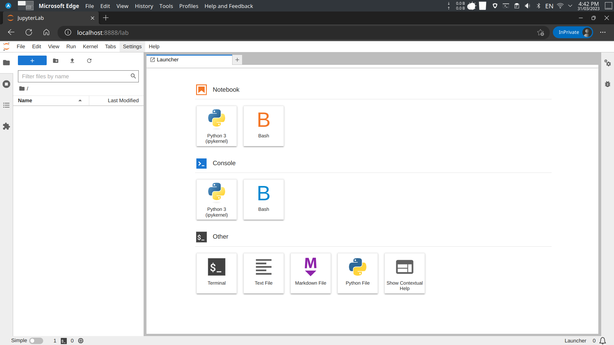

# Dockerized Jupyter Notebook

Welcome to the Dockerized Jupyter Notebook environment, a versatile platform with essential tools pre-installed to empower your data science and development workflows. Built on the latest Ubuntu version, this container includes Node.js, Pandoc, Git, and various Python libraries.

## Requirements

Before diving in, make sure you have the following prerequisites installed on your machine:

- [Docker](https://www.docker.com/)
- [Docker Compose](https://docs.docker.com/compose/)

## Getting Started

### Clone the Repository

Begin your journey by cloning the repository to your local machine:

```bash
# clone the repository
git clone --depth 1 https://github.com/MKAbuMattar/dockerized-jupyter-notebook.git

# navigate to the project directory
cd dockerized-jupyter-notebook
```

### Cloud / Tool Support

Our Docker container is armed with various command-line interfaces (CLIs) for cloud services, covering AWS, Azure, Google Cloud, Docker, Terraform, Helm, Kubectl, and Ansible. These tools are pre-installed, enabling seamless interaction with cloud platforms from within the Jupyter Notebook environment.

To tailor the tool support to your needs, edit the `.env` file and set the corresponding environment variables to `true`:

```bash
AWS_CLI=false
AZURE_CLI=false
GCP_CLI=false
DOCKER_CLI=false
TERRAFORM_CLI=false
HELM_CLI=false
KUBECTL_CLI=false
ANSIBLE_CLI=false
```

Adjust the values to `true` for the tools you wish to install. For instance, to include the AWS CLI, set the `AWS_CLI` environment variable to `true`:

```diff
-  AWS_CLI=false
+  AWS_CLI=true
  # ... (adjust other variables as needed)
```

### Build the Image

With the repository cloned and tool support configured, build the Docker image using the following command:

```bash
# build the image
docker-compose build
```

### Run the Container

Now, launch the container with the following command:

```bash
# run the container
docker-compose up -d
```

This command initializes a container named `jupyter`, mapping port `8888` to the host and mounting the `notebook` directory to the container's `/notebook` directory.

### Access Jupyter Notebook

Open a web browser and navigate to `http://localhost:8888`. You will be directed to the Jupyter Notebook's home page without requiring a token or password.



### Stop the Container

To halt the container when you're done, use the following command:

```bash
# stop the container
docker-compose down
```

## License

This project is licensed under the [MIT License](LICENSE). Feel free to explore, contribute, and adapt it to suit your needs. Happy coding!
