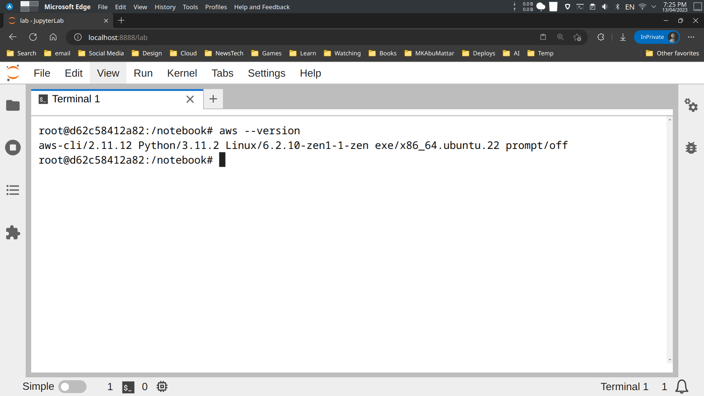
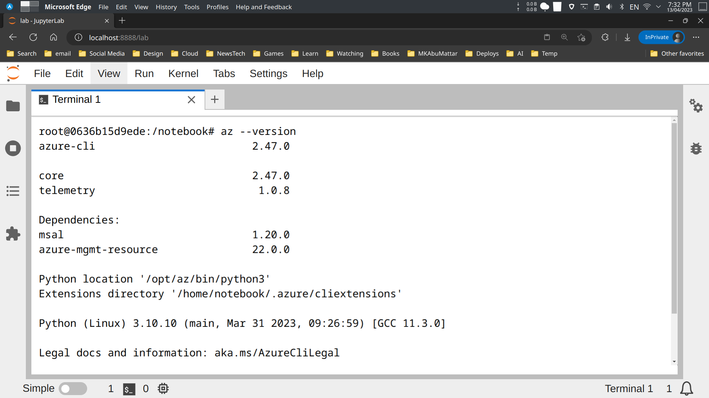
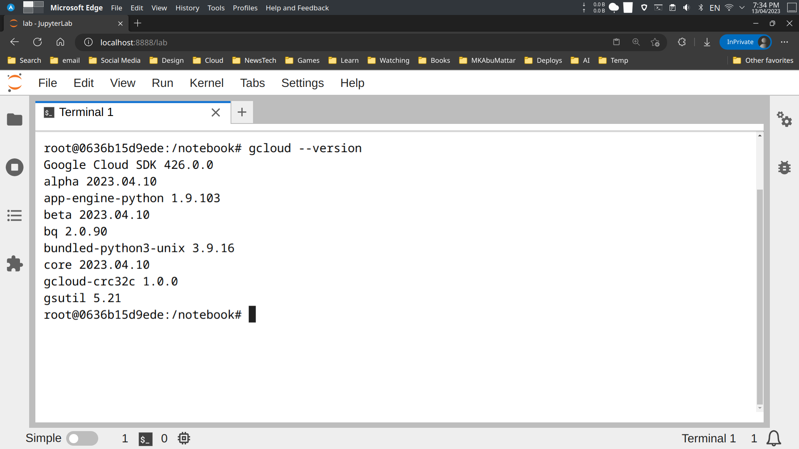

# Dockerized Jupyter Notebook

This Docker container provides a Jupyter Notebook environment with some useful tools pre-installed. It's based on Ubuntu latest version and includes Node.js, Pandoc, Git, and several Python libraries.

## Requirements

- [Docker](https://www.docker.com/)
- [Docker Compose](https://docs.docker.com/compose/)

## Usage

### Clone the repository

First, clone the repository to your local machine:

```bash
# clone the repository
git clone --depth 1 https://github.com/MKAbuMattar/dockerized-jupyter-notebook.git

# change directory
cd dockerized-jupyter-notebook
```

### Build the image

To build the image, run the following command:

```bash
# build the image
docker-compose build
```

### Cloud Support

This Docker container comes pre-installed with the AWS CLI, Azure CLI, and Google Cloud SDK. You can use these command-line interfaces to interact with cloud services from within the Jupyter Notebook environment.

To use the AWS CLI, set the `AWS_CLI` argument to `true` when building the Docker image:

```bash
# build the image with AWS CLI support
docker-compose build --build-arg AWS_CLI=true
```

You can then use the `aws` command within the Jupyter Notebook environment to interact with AWS services.



To use the Azure CLI, set the `AZURE_CLI` argument to `true` when building the Docker image:

```bash
# build the image with Azure CLI support
docker-compose build --build-arg AZURE_CLI=true
```

You can then use the `az` command within the Jupyter Notebook environment to interact with Azure services.



To use the Google Cloud SDK, set the `GCP_CLI` argument to `true` when building the Docker image:

```bash
# build the image with Google Cloud SDK support
docker-compose build --build-arg GCP_CLI=true
```

You can then use the `gcloud` command within the Jupyter Notebook environment to interact with Google Cloud services.



Note that you will need to authenticate with your cloud provider and configure your credentials before using these command-line interfaces. For more information on how to do this, refer to the documentation for each provider.

### Run the container

To run the container, run the following command:

```bash
# run the container
docker-compose up -d
```

This will start a container named `jupyter` that maps port `8888` to the host and mounts the `notebook` directory to the container's `/notebook` directory.

You can access the Jupyter Notebook by opening a web browser and navigating to `http://localhost:8888`. You will be navigated to the Jupyter Notebook's home page without a token, or password.


### Stop the container

To stop the container, run the following command:

```bash
# stop the container
docker-compose down
```

## License

This project is licensed under the [MIT License](LICENSE)
